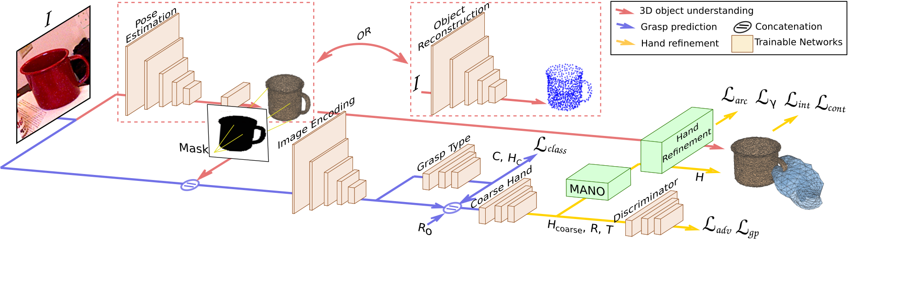

# GanHand
[[Project]](http://www.iri.upc.edu/people/ecorona/ganhand/) [[Paper]](http://openaccess.thecvf.com/content_CVPR_2020/papers/Corona_GanHand_Predicting_Human_Grasp_Affordances_in_Multi-Object_Scenes_CVPR_2020_paper.pdf) [[Dataset]](https://github.com/enriccorona/YCB_Affordance)

<p float="left">


</p>

## Dataset

Checkout the github repository to download the [YCB-Affordance dataset](https://github.com/enriccorona/YCB_Affordance). This contains the 3D models of objects from the YCB benchmark, the videos from the YCB-Video Dataset, and the human hand grasps from the YCB-Affordance dataset.


## Requirements

- conda create -n ganhand python=3.6
- conda activate ganhand
- Python requirements: Run `pip install -r requirements.txt`.
- **MANO layer**: Follow instructions from the MANO layer project in [here](https://raw.githubusercontent.com/hassony2/manopth).

## Data
- Link to repository of the data
- We use [https://github.com/cvlab-epfl/segmentation-driven-pose](https://github.com/cvlab-epfl/segmentation-driven-pose) to estimate the pose of the objects in the YCB-Video dataset . You can download the predictions for all train and test samples from the YCB dataset in TODO:DRIVELINK, and move them in the YCB Affordance dataset folder

## Model



GanHand takes a single RGB image of one or several objects and predicts how a human would grasp these objects naturally. Our architecture consists of three stages. First, the objects' shapes and locations are estimated in the scene using an object 6D pose estimator or a reconstruction network (red). The predicted shape is then projected onto the image plane to obtaina segmentation mask that is concatenated with the input image and fed to the second sub-network for grasp prediction (blue). Finally, werefine the hand parameters and obtain hand final shapes and poses using a differentiable parametric model MANO (yellow). The model is trained using adversarial, interpenetration, classification and optimization losses, indicated in bold.

## Test

Videos like those in the teaser of the paper can be obtained running the following command. 

```
python test.py --dataset_mode ycb_affordances_complete_scene --name ganhand_pretrained --load_epoch 13
```

<!--
## Train
...
...
-->


## Acknowledgements
- In this paper, we make extensive use of the [differentiable MANO model](https://raw.githubusercontent.com/hassony2/manopth)
- We follow the deep learning model framework from [IRI-DL](https://github.com/albertpumarola/IRI-DL)

## Citation

If this dataset is useful in your research, please cite:

```
@inproceedings{corona2020ganhand,
  title={Ganhand: Predicting human grasp affordances in multi-object scenes},
  author={Corona, Enric and Pumarola, Albert and Alenya, Guillem and Moreno-Noguer, Francesc and Rogez, Gr{\'e}gory},
  booktitle={Proceedings of the IEEE/CVF Conference on Computer Vision and Pattern Recognition},
  pages={5031--5041},
  year={2020}
}
```

## License

The YCB-Affordance dataset is released only for research purposes

